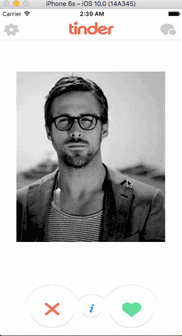

# Lab 5 - *Tinder*

**Tinder** 
Use animation to simulate Tinder.

Time spent: **4** hours spent in total

## User Stories

The following **required** functionality is completed:

* [x] Setup
* [x] Build the Main Screen
* [x] Create a Custom View for the Draggable Image
* [x] Rotate the Photo during the Pan
* [x] Final Resting Place for the Photo
* [x] Build the Details Screen

Optionals:

* [ ] Create a Custom Modal Transition

## Video Walkthrough

Here's a walkthrough of implemented user stories:

GIF created with [LiceCap](http://www.cockos.com/licecap/).

## Notes

Understand the clock and anti-clock rotation was tough.

## License

    Copyright 2016 Ian Campelo

    Licensed under the Apache License, Version 2.0 (the "License");
    you may not use this file except in compliance with the License.
    You may obtain a copy of the License at

        http://www.apache.org/licenses/LICENSE-2.0

    Unless required by applicable law or agreed to in writing, software
    distributed under the License is distributed on an "AS IS" BASIS,
    WITHOUT WARRANTIES OR CONDITIONS OF ANY KIND, either express or implied.
    See the License for the specific language governing permissions and
    limitations under the License.
